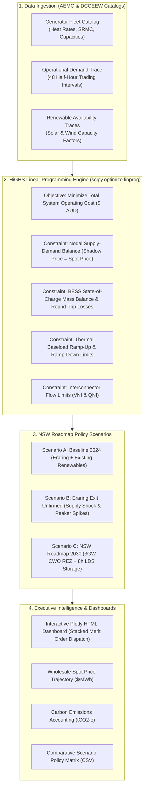

# National Electricity Market (NEM) Dispatch & Unit Commitment Simulator

[](https://www.python.org/downloads/)
[](https://opensource.org/licenses/MIT)
[](https://highs.dev/)
[](https://www.energy.nsw.gov.au/nsw-plans-and-progress/major-state-projects/electricity-infrastructure-roadmap)

> An open-source, production-grade National Electricity Market (NEM) Economic Dispatch and Unit Commitment simulation engine developed in Python. 
> Formulates the multi-interval linear programming (LP) optimization problem that underpins commercial packages like **PLEXOS (ST Schedule)** and **AEMO's NEMDE**, co-optimizing battery energy storage (BESS) cycling, thermal ramp limits, transmission interconnectors, and NSW policy scenarios.

**Author**: **Dr. Md Mahmudur Rahman (PhD)**  
*Senior Data Analytics Lead | Former Atmospheric Scientist, NSW DPIE / DCCEEW*  
*Repository*: [`https://github.com/mahmudurah/nem-dispatch-simulator`](https://github.com/mahmudurah/nem-dispatch-simulator)

---

## 1. Overview & Motivation

The transition of the Australian National Electricity Market (NEM) requires sophisticated computational tools to evaluate how retiring coal-fired generation (such as **Eraring**, **Bayswater**, and **Mt Piper**) interacts with intermittent renewables (Renewable Energy Zones - REZs), battery storage systems (BESS), and firming peaking infrastructure.

While commercial platforms like **PLEXOS** are widely deployed, their proprietary nature and desktop GUI interfaces can obscure the underlying mathematical mechanics. This project provides a transparent, high-performance, and fully auditable simulation engine built from first principles to:
1. **Solve multi-interval economic dispatch** using the industrial **HiGHS Linear Programming (LP)** solver.
2. **Extract nodal clearing prices ($\lambda_t$)** as the mathematical dual variables (shadow prices) of the supply-demand balance constraint.
3. **Co-optimize Battery Storage (BESS) & Pumped Hydro (PHES)**: charging during negative/low midday solar troughs and discharging during high-value evening demand ramps.
4. **Stress-test NSW policy scenarios** under the *NSW Electricity Infrastructure Roadmap*.

---

## 2. Architecture & Mathematical Engine



For the formal mathematical proofs, objective equations, and dual variable formulations, see [docs/MATHEMATICAL_FORMULATION.md](docs/MATHEMATICAL_FORMULATION.md).

For a detailed analysis comparing this simulator to PLEXOS modules, see [docs/PLEXOS_VS_NEM_SIMULATOR.md](docs/PLEXOS_VS_NEM_SIMULATOR.md).

---

## 3. Comparative Policy Scenario Findings (NSW Fleet)

We simulated a 24-hour cycle (48 half-hour trading intervals) representing a high-demand NSW winter day with strong rooftop solar penetration and an evening peak of **10,750 MW**:

| Policy Scenario | Total Daily Cost | Average Spot Price | Daily Emissions | Unserved Energy | Policy Takeaway |
| :--- | :---: | :---: | :---: | :---: | :--- |
| **1. Baseline (2024 Operating Grid)** | **\$5.52M AUD** | **\$49.80 / MWh** | 119.8 kt $\text{CO}_2\text{-e}$ | **0.0 MWh** | Stable baseload with moderate solar curtailment during midday. |
| **2. Eraring Retirement (Unfirmed Exit)** | **\$8.22M AUD** *(+49%)* | **\$131.01 / MWh** *(+163%)* | 96.6 kt $\text{CO}_2\text{-e}$ | **0.0 MWh** | Removing 2,880 MW thermal capacity forces expensive gas peakers (Colongra/Uranquinty @ \$225/MWh) to set the clearing price during evening ramps. |
| **3. NSW Roadmap 2030 (CWO REZ + Storage)** | **\$4.72M AUD** *(-14.5%)* | **\$69.54 / MWh** | **85.7 kt $\text{CO}_2\text{-e}$** *(-28.5%)* | **0.0 MWh** | 3.3 GW of REZ solar/wind plus 1,200 MW Long-Duration Storage and Waratah BESS flattens price spikes, eliminates gas peakers, and slashes emissions. |

### Strategic Takeaways for DCCEEW:
1. **The Peaker Spike Mechanism**: When thermal baseload exits without firming, the market does not necessarily face blackouts, but the marginal clearing price surges by **+163%** as the bid stack moves up to OCGT peakers.
2. **The Long-Duration Storage Dividend**: Batteries alone (1–2h) cannot fully bridge the post-sunset evening ramp; 8-hour Long-Duration Storage (LDS Pumped Hydro) is essential to maintain system stability without burning fossil fuels.

---

## 4. Quickstart Guide

### Installation
Clone the repository and install the dependencies:
```bash
git clone https://github.com/mahmudurah/nem-dispatch-simulator.git
cd nem-dispatch-simulator
pip install -r requirements.txt
```

### Run Policy Comparison & Generate Interactive Dashboard
Execute the full comparative workflow across all three NSW policy scenarios:
```bash
python -m nem_simulator.cli --compare --dashboard
```
This generates:
* `output/scenario_comparison_summary.csv`: Summary metrics table.
* `output/nem_dispatch_dashboard.html`: Standalone, interactive multi-panel Plotly dashboard. Open this file directly in any browser:
```bash
# Windows
start output/nem_dispatch_dashboard.html
```

### Run a Specific Scenario
```bash
python -m nem_simulator.cli --scenario NSW_Roadmap_2030
```

### Run the Example Analysis Script
```bash
python examples/run_nsw_roadmap_analysis.py
```

### Run Automated Unit Tests
```bash
python -m unittest discover tests
```

---

## 5. Python API Usage

You can easily integrate the simulator into your own data science pipelines:

```python
from nem_simulator.scenarios import load_nsw_scenario, load_trace_data, get_nsw_interconnectors
from nem_simulator.model import NEMDispatchEngine

# 1. Load NSW Roadmap scenario assets
generators, storage = load_nsw_scenario("NSW_Roadmap_2030")
interconnectors = get_nsw_interconnectors()

# 2. Ingest demand and renewable availability traces
traces = load_trace_data()
demand = traces['operational_demand_mw'].tolist()
solar_cf = traces['solar_capacity_factor'].tolist()
wind_cf = traces['wind_capacity_factor'].tolist()

# 3. Instantiate Engine & Solve Economic Dispatch
engine = NEMDispatchEngine(
    generators=generators,
    storage_assets=storage,
    interconnectors=interconnectors,
    interval_minutes=30
)

result = engine.solve(
    demand_trace_mw=demand,
    solar_capacity_factor=solar_cf,
    wind_capacity_factor=wind_cf,
    enforce_ramp_rates=True
)

# 4. Inspect Results & Shadow Prices
print(f"Optimal Total Cost : ${result.total_cost:,.2f} AUD")
print(f"Average Spot Price : ${result.average_price_per_mwh:.2f} / MWh")
print(f"Total Emissions    : {result.total_emissions_tco2:,.1f} tCO2-e")

# Interval clearing prices ($/MWh)
print(result.prices_df[['interval', 'demand_mw', 'clearing_price_per_mwh']].head())
```

---

## 6. Project Structure

```
nem-dispatch-simulator/
├── README.md                              # Main documentation & results
├── requirements.txt                        # Dependency manifest
├── pyproject.toml                         # Packaging specification
├── data/
│   ├── generators_nsw.csv                 # Detailed NSW generator parameters
│   └── demand_and_renewables_48hh.csv     # 48 half-hour trading interval traces
├── nem_simulator/
│   ├── __init__.py
│   ├── generator.py                       # Generator, Storage & Interconnector classes
│   ├── model.py                           # HiGHS LP Economic Dispatch Engine
│   ├── scenarios.py                       # NSW policy scenario definitions
│   ├── visualization.py                   # Plotly multi-panel HTML generator
│   └── cli.py                             # Command-Line Interface
├── examples/
│   └── run_nsw_roadmap_analysis.py        # End-to-end policy execution script
├── tests/
│   └── test_dispatch.py                   # Automated mathematical verification tests
├── docs/
│   ├── MATHEMATICAL_FORMULATION.md        # LaTeX equations & constraints
│   └── PLEXOS_VS_NEM_SIMULATOR.md         # PLEXOS architectural comparison
└── output/
    ├── nem_dispatch_dashboard.html        # Interactive Plotly dashboard
    └── scenario_comparison_summary.csv    # Comparative CSV metrics
```

---

## 7. License & Acknowledgements

Developed under the **MIT License**.

Built for research, educational, and public policy purposes to support Australia's clean energy transition. Uses operational parameters modeled after AEMO National Electricity Market MMS specifications and the NSW Electricity Infrastructure Roadmap.
