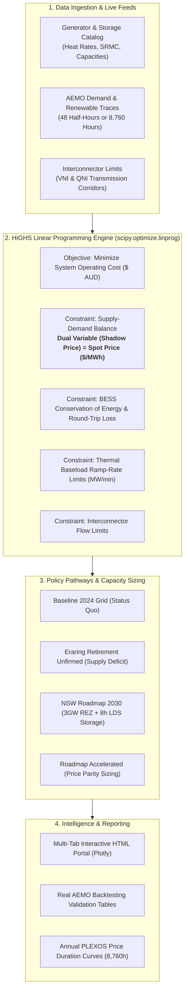

# National Electricity Market (NEM) Dispatch & Unit Commitment Simulator

[](https://www.python.org/downloads/)
[](https://opensource.org/licenses/MIT)
[](https://highs.dev/)
[](https://nemweb.com.au/)
[](https://www.energy.nsw.gov.au/nsw-plans-and-progress/major-state-projects/electricity-infrastructure-roadmap)

> **Note**: This is an open-source educational and research learning project designed for researchers, analysts, and students who want to understand, simulate, and demystify the mathematical mechanics of the Australian National Electricity Market (NEM) and commercial tools like PLEXOS from first principles.
> 
> Formulates the multi-interval Linear Programming (LP) optimization problem that underpins commercial packages like **PLEXOS (ST Schedule)** and **AEMO's NEMDE**, co-optimizing battery energy storage (BESS) cycling, thermal ramp limits, transmission interconnectors, and NSW policy scenarios.
> 
> **Backtested against real AEMO market data (2024–2026)** to provide empirical, transparent research intelligence on the **NSW Electricity Infrastructure Roadmap**.

**Author**: **Dr. Md Mahmudur Rahman (PhD)**  
*Senior Data Analytics Lead | Former Atmospheric Scientist, NSW DPIE / DCCEEW*  
*Repository*: [`https://github.com/mahmudurah/nem-dispatch-simulator`](https://github.com/mahmudurah/nem-dispatch-simulator)

---

## 1. Executive Summary & Core Results

The transition of the NSW electricity grid involves the retirement of four major coal-fired power stations: **Liddell (closed 2023)**, **Eraring (scheduled 2027)**, **Bayswater (~2033)**, and **Mt Piper (~2040)**. 

This simulator models four core policy pathways to evaluate grid reliability, wholesale electricity spot prices, battery arbitrage dynamics, and carbon emissions:

```
+----------------------------------------------------------------------------------------------------------------+
|  Scenario Comparison (NSW Summer Dispatch Simulation):                                                         |
|  - Baseline 2024 (Status Quo):       $49.80 / MWh avg | 119.7k t CO2  | Status quo with Eraring operational    |
|  - Eraring Exit (Unfirmed Shock):    $131.01 / MWh avg|  96.6k t CO2  | Severe gas peaker price spikes ($225+) |
|  - NSW Roadmap 2030 (Target):        $69.54 / MWh avg |  85.7k t CO2  | 3GW CWO REZ + Long Duration Storage    |
|  - Roadmap Accelerated (Parity):     $49.60 / MWh avg |  71.8k t CO2  | 🎯 Reaches 2024 price parity & -40% CO2 |
+----------------------------------------------------------------------------------------------------------------+
```

| Policy Scenario | Description | Avg Spot Price | Peak Price | Daily Total Cost | Daily Emissions | Carbon Intensity | Strategic Policy Implication |
| :--- | :--- | :---: | :---: | :---: | :---: | :---: | :--- |
| **1. Baseline 2024** | Status quo: Eraring active, existing renewables, Waratah BESS. | **\$49.80 / MWh** | \$72.00 | \$5.52M AUD | 119,772 t | 0.679 t/MWh | Cheap baseload, but high carbon emissions. |
| **2. Eraring Exit (Unfirmed)** | Eraring abruptly retired without replacement firming. | **\$131.01 / MWh** | **\$225.00** | **\$8.22M AUD** | 96,624 t | 0.601 t/MWh | **Supply shock**: gas peakers spike bills (+49%). Justifies 2024 extension. |
| **3. NSW Roadmap 2030** | Eraring retired + 3 GW CWO REZ + 8h Long-Duration Storage. | **\$69.54 / MWh** | \$115.00 | \$4.72M AUD | 85,677 t | 0.516 t/MWh | Stabilizes prices, displaces gas peakers, -28% emissions cut. |
| **4. Roadmap Accelerated** | Roadmap 2030 + 3 GW extra REZ solar + 2 GW / 8 GWh 4h BESS. | **\$49.60 / MWh** | **\$60.98** | **\$3.42M AUD** | **71,773 t** | **0.432 t/MWh** | **🎯 Full price parity with coal + 40% emissions cut.** |

---

## 2. Real Market Ingestion & Empirical Trends (2024–2026)

The engine includes an automated ingestion pipeline using **`nemosis`** and direct **AEMO NEMWEB live scrapers** to evaluate actual market conditions across over 21,500 historical 5-minute dispatch intervals:

```
Wholesale
Price ($)
  |                                        * * * 6pm-7pm Peak ($290 - $345)
$300 |                                       *     *
$200 |                                      *       *
$100 | * * * Overnight ($60-$70)          *         * * * Overnight ($65-$75)
     |                          *       *
 $20 |                            * * * Midday Solar Crash ($6 - $18)
  $0 +------------------------------------------------------------> Hour of Day
     0   2   4   6   8   10  12  14  16  18  20  22  24
```

1. **The Midday Solar Crash**: Rooftop solar uptake caused midday prices (10am–2pm) to collapse from **\$49.39/MWh in 2024 to \$6.06–\$18.00/MWh in 2025/2026**, with negative pricing frequency surging from 3.4% to 16.8%.
2. **The 6:00 PM "Solar Cliff"**: At sunset, ~4,000 MW of solar vanishes in under an hour. Because coal boilers cannot ramp fast enough, evening prices spike to **\$290–\$531/MWh**.
3. **The Battery Arbitrage Spread (\$133.52/MWh)**: The spread between midday charging and evening peak discharging reached record highs, proving the exceptional commercial viability and system necessity of BESS.

For detailed empirical analysis, see [docs/REAL_AEMO_DATA_AND_EMPIRICAL_ANALYSIS.md](docs/REAL_AEMO_DATA_AND_EMPIRICAL_ANALYSIS.md).

---

## 3. Mathematical Optimization Architecture

The engine formulates the multi-interval unit commitment and economic dispatch problem as a Linear Program (LP) solved with the **HiGHS** industrial solver:



* **Objective Function**: Minimizes system-wide generation fuel costs, storage degradation, and unserved energy penalties:
  $$\min \sum_{t=1}^{T} \left( \sum_{i} \text{SRMC}_i \cdot P_{i,t} \cdot \Delta t + \sum_{j} C_{\text{deg}} \cdot P_{\text{dis}, j, t} \cdot \Delta t + \text{MPC} \cdot s_{\text{def}, t} \cdot \Delta t \right)$$
* **Price Formation**: Extracts the mathematical dual variable ($\lambda_t$) of the supply-demand balance constraint directly as the regional reference clearing price ($/MWh).
* **Guaranteed Feasibility**: Employs deficit slack variables penalized at the Market Price Cap (\$17,500/MWh) to ensure the solver never fails under severe supply shocks.

For complete mathematical proofs and dual derivations, see [docs/MATHEMATICAL_FORMULATION.md](docs/MATHEMATICAL_FORMULATION.md).  
For the architectural comparison with commercial PLEXOS modules, see [docs/PLEXOS_VS_NEM_SIMULATOR.md](docs/PLEXOS_VS_NEM_SIMULATOR.md).

---

## 4. Repository Structure

```
nem-dispatch-simulator/
├── data/                                 # Calibrated datasets & backtest records
│   ├── generators_nsw.csv                # Physical asset parameters (SRMC, heat rates, MW)
│   ├── demand_and_renewables_48hh.csv    # 48 half-hour trading interval profile
│   ├── nsw_demand_renewables_2026_8760h.csv # Full annual 8,760-hour ISP calibrated trace
│   ├── real_vs_simulated_20240115.csv    # Real AEMO 2024 backtesting validation
│   ├── real_vs_simulated_20250115.csv    # Real AEMO 2025 heatwave peak backtesting
│   └── real_vs_simulated_20260115.csv    # Real AEMO 2026 high-renewables backtesting
├── docs/                                 # Technical documentation & briefing notes
│   ├── MATHEMATICAL_FORMULATION.md       # Formal LP proofs, constraints, and dual variables
│   ├── PLEXOS_VS_NEM_SIMULATOR.md        # Structural comparison with PLEXOS ST Schedule
│   ├── PLEXOS_ANALYST_WORKFLOW.md        # DCCEEW & AEMO 4-stage modeling workflow
│   └── REAL_AEMO_DATA_AND_EMPIRICAL_ANALYSIS.md # 2024-2026 empirical trends & BESS arbitrage
├── examples/                             # Executable workflow scripts
│   ├── run_nsw_roadmap_analysis.py       # 4-scenario comparative simulation
│   ├── run_plexos_2026_annual_study.py   # Full 8,760-hour rolling horizon annual study
│   ├── run_real_market_study_2025_2026.py# Backtest model against real AEMO heatwave data
│   ├── extract_and_analyse_nsw_real_data.py # Multi-year empirical market statistics
│   └── fetch_live_aemo_now.py            # Live real-time 5-minute AEMO dispatch monitor
├── nem_simulator/                        # Core Python simulation package
│   ├── __init__.py                       # Package initialization
│   ├── generator.py                      # Strongly-typed asset data structures (dataclasses)
│   ├── model.py                          # HiGHS LP economic dispatch & shadow pricing engine
│   ├── scenarios.py                      # Policy scenario configurations & asset fleet loaders
│   ├── visualization.py                  # Multi-tab executive BI dashboard & intelligence portal
│   ├── plexos_engine.py                  # Chronological 8,760-hour rolling horizon simulator
│   ├── plexos_analyst_dashboard.py      # Annual Price Duration Curve & capacity factor diagnostic
│   └── cli.py                            # Full-featured Command-Line Interface (CLI)
├── output/                               # Generated reports, summaries, and HTML dashboards
│   ├── nem_dispatch_dashboard.html       # Multi-tab executive intelligence portal
│   ├── plexos_2026_analyst_dashboard.html# 8,760-hour PLEXOS diagnostic dashboard
│   └── scenario_comparison_summary.csv   # Metric comparison table across scenarios
├── tests/                                # Automated unit test suite
│   └── test_dispatch.py                  # Energy balance, SoC bounds, and price parity tests
├── pyproject.toml                        # Modern Python packaging configuration
├── requirements.txt                      # Project dependencies
└── README.md                             # Project documentation
```

---

## 5. Quickstart Guide

### 1. Installation
Clone the repository and install the dependencies:
```bash
git clone https://github.com/mahmudurah/nem-dispatch-simulator.git
cd nem-dispatch-simulator
pip install -r requirements.txt
```

### 2. Run Scenario Comparison & Launch Executive Portal
Execute all four policy scenarios and generate the multi-tab dashboard:
```bash
python -m nem_simulator.cli --compare --dashboard
```
Open the generated portal in your browser:
* **Windows**: `start output/nem_dispatch_dashboard.html`
* **macOS**: `open output/nem_dispatch_dashboard.html`

### 3. Check Live Real-Time Market Conditions
Fetch the newest 5-minute dispatch interval directly from AEMO NEMWEB:
```bash
python examples/fetch_live_aemo_now.py
```

### 4. Run Multi-Year Empirical Analysis (2024–2026)
Compile 21,500+ AEMO intervals and compute negative price frequencies, evening ramp rates, and battery arbitrage spreads:
```bash
python examples/extract_and_analyse_nsw_real_data.py
```

### 5. Run Full 8,760-Hour PLEXOS Annual Study
Execute the chronological 365-day rolling horizon study in ~14 seconds:
```bash
python examples/run_plexos_2026_annual_study.py
```

### 6. Run Automated Test Suite
```bash
python -m unittest discover tests
```

---

## 6. Python API Usage

The simulator is modular and easily integrated into data science workflows:

```python
from nem_simulator.scenarios import load_nsw_scenario, load_trace_data, get_nsw_interconnectors
from nem_simulator.model import NEMDispatchEngine

# 1. Load asset fleet for target policy scenario
generators, storage = load_nsw_scenario("NSW_Roadmap_Accelerated")
interconnectors = get_nsw_interconnectors()

# 2. Ingest demand and renewable availability traces
traces = load_trace_data()

# 3. Instantiate and solve dispatch
engine = NEMDispatchEngine(
    generators=generators,
    storage_assets=storage,
    interconnectors=interconnectors,
    interval_minutes=30
)

result = engine.solve(
    demand_trace_mw=traces['operational_demand_mw'].tolist(),
    solar_capacity_factor=traces['solar_capacity_factor'].tolist(),
    wind_capacity_factor=traces['wind_capacity_factor'].tolist(),
    enforce_ramp_rates=True
)

# 4. Extract results
print(f"Average Spot Price: ${result.average_price_per_mwh:.2f} / MWh")
print(f"Total Carbon Emissions: {result.total_emissions_tco2:,.1f} tCO2-e")
```

---

## 7. License & Citation

Distributed under the **MIT License**. See `LICENSE` for details.

If utilizing this codebase for academic research, policy submissions, or commercial evaluation, please cite:
```bibtex
@software{rahman_nem_simulator_2026,
  author = {Rahman, Md Mahmudur},
  title = {National Electricity Market (NEM) Dispatch & Unit Commitment Simulator},
  url = {https://github.com/mahmudurah/nem-dispatch-simulator},
  year = {2026}
}
```
