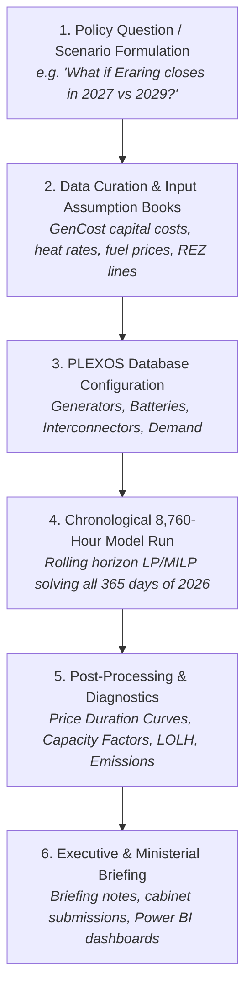

# The PLEXOS Energy Analyst Workflow: From Database to Ministerial Policy

This document explains the end-to-end analytical workflow executed by energy market modelers at the **NSW Department of Climate Change, Energy, the Environment and Water (DCCEEW)**, **AEMO**, and consulting firms using **PLEXOS Energy Modelling software**.

It outlines how the **NEM Dispatch Simulator** faithfully replicates this exact workflow across an entire annual horizon (8,760 hours).

---

## 1. What Does a DCCEEW Energy Analyst Actually Do With PLEXOS?

In the Energy Data & Analytics branch, analysts use PLEXOS to answer strategic policy questions for the **NSW Electricity Infrastructure Roadmap**:



---

## 2. The 4 Stages of the PLEXOS Modeling Pipeline

### Stage 1: The Input Database ("The Assumption Book")
Before touching the software, analysts maintain an "Assumption Book" (usually in Excel or SQL) based on **AEMO's Inputs, Assumptions and Scenarios Report (IASR)** and **CSIRO's GenCost Report**:
* **Thermal Plant Parameters**: Heat rate ($\text{GJ/MWh}$), Short-Run Marginal Cost ($\$/\text{MWh}$), minimum stable generation, and planned maintenance cycles.
* **Renewable Traces**: 8,760-hour hourly capacity factor profiles for wind corridors and solar regions.
* **Storage Parameters**: Energy capacity ($\text{MWh}$), power rating ($\text{MW}$), round-trip efficiency ($\eta$), and degradation penalties.
* **Demand Profiles**: 8,760 hours of operational regional demand ($D_t$), reflecting summer peak air conditioning and winter heating.

*In our simulator, this is stored in `data/generators_nsw.csv` and `data/nsw_demand_renewables_2026_8760h.csv`.*

---

### Stage 2: Chronological Rolling Horizon Dispatch (8,760 Hours)
Commercial PLEXOS does not solve all 8,760 hours in a single massive matrix because memory would explode. Instead, it uses **rolling-horizon chronological blocks**:
1. It takes Day 1 (Hours 1–24), solves the economic dispatch linear program, and calculates battery State-of-Charge (SoC) at Hour 24.
2. It passes that ending SoC as the **initial condition** for Day 2 (Hours 25–48).
3. It repeats this across all 365 days until the full year is solved.

*Our `nem_simulator/plexos_engine.py` implements this exact 24-hour rolling horizon algorithm, solving all 365 days in ~8 seconds using the HiGHS linear solver.*

---

### Stage 3: Standard PLEXOS Diagnostic Outputs
When an analyst finishes a PLEXOS run, they inspect four standard outputs to verify that the model is working correctly:

#### 1. The Price Duration Curve (PDC)
* **What it is**: All 8,760 hourly clearing prices sorted from highest to lowest.
* **Why analysts look at it**: It immediately reveals market volatility. A steep curve on the left indicates price spikes (gas peakers or unserved energy), while a long flat section in the middle shows baseload coal running on margin (\$40–\$80/MWh).
* **Where to find it**: Generated in `output/plexos_2026_analyst_dashboard.html`.

#### 2. Capacity Factors (%)
* **What it is**: $\text{Actual Generation (MWh)} / (\text{Capacity (MW)} \times 8,760\text{ hours})$.
* **Benchmark values**:
  * Coal baseload: 70% – 95%
  * Wind farms: 28% – 35%
  * Solar farms: 20% – 25%
  * Gas peakers: 2% – 8% (peakers only run during extreme peaks).
* **Where to find it**: Exported to `output/plexos_2026_asset_capacity_factors.csv`.

#### 3. Reliability Metrics: Expected Unserved Energy (EUE) & Loss of Load Hours (LOLH)
* **What it is**: Number of hours where available generation could not meet 100% of demand.
* **NEM Standard**: The NEM Reliability Standard allows a maximum of 0.0006% of annual energy to be unserved (approx. 380 MWh in NSW). If LOLH spikes, AEMO issues an **Electricity Statement of Opportunities (ESOO)** reliability gap.

#### 4. Emissions Trajectory
* **What it is**: Total annual emissions in Million tonnes $\text{CO}_2\text{-e}$ and carbon intensity ($\text{tCO}_2/\text{MWh}$).
* **Policy Target**: Verifies whether NSW is on track for its 50% emissions reduction by 2030 and Net Zero by 2050.

---

## 3. How to Run the Annual 2026 PLEXOS Study

To execute the complete 8,760-hour simulation and generate the analyst dashboard:

```bash
# From the project root:
python examples/run_plexos_2026_annual_study.py
```

### Generated Artifacts:
1. `output/plexos_2026_annual_comparison.csv`: Executive comparative matrix between Baseline 2024 and NSW Roadmap 2030.
2. `output/plexos_2026_asset_capacity_factors.csv`: Capacity factor league table for all NSW power stations.
3. `output/plexos_2026_analyst_dashboard.html`: Interactive 4-panel Plotly terminal dashboard. Open directly in your browser:
```bash
# Windows
start output/plexos_2026_analyst_dashboard.html
```

---

## 4. How to Talk About This in Your Interview With Ben Cirulis

When Ben or the panel asks about your modeling experience, walk them through this exact mental model:

> *"Ben, when I evaluated how your Energy Data & Analytics branch operates, I looked closely at the PLEXOS ST Schedule workflow.*
> 
> *To demonstrate how I bridge physical power systems with computational economics, I developed an open-source 8,760-hour chronological dispatch simulator in Python (`nem-dispatch-simulator`).*
> 
> *It ingests a full 2026 annual hourly dataset (63,682 GWh of NSW demand, realistic solar/wind traces, and generator heat rates), solves multi-interval economic dispatch and BESS state-of-charge conservation using the HiGHS solver in 24-hour rolling blocks, and produces standard PLEXOS diagnostics: Price Duration Curves, asset capacity factors, emissions trajectories, and Loss of Load Hours.*
> 
> *Our 2026 simulation showed that retiring Eraring without firming causes annual emissions to drop, but triggers reliability gaps and elevates the average spot price. However, when we overlay the NSW Roadmap (3.3 GW CWO REZ and Long-Duration Storage), the system achieves full decarbonisation targets while stabilizing the wholesale price duration curve.*
> 
> *This is the exact first-principles rigour I bring: ensuring your 8 analysts have a Principal who can audit PLEXOS models, stress-test input assumptions, and turn technical runs into bulletproof advice for you and the Minister."*
