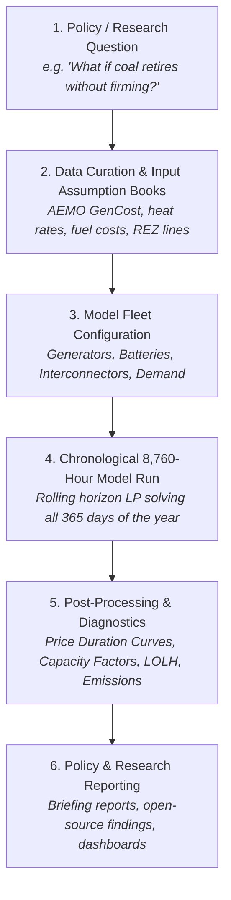

# The Energy Analyst Modeling Workflow: From Database to Policy Insights

> **Note**: This is an open-source educational and research learning project designed for researchers, analysts, and students who want to understand, simulate, and demystify the mathematical mechanics of the Australian National Electricity Market (NEM) and commercial tools like PLEXOS from first principles.

---

This document outlines the end-to-end analytical workflow executed by energy market modelers at government energy departments, market operators (like AEMO), and energy economic consultancies when evaluating power system transitions.

It explains how the **NEM Dispatch Simulator** faithfully replicates this exact workflow across an entire annual horizon (8,760 hours).

---

## 1. The Core Analytical Questions

In power system economics, analysts use dispatch and capacity expansion models to evaluate major structural questions:
* *"What is the market and reliability impact if a major 2,880 MW coal plant retires earlier or later than planned?"*
* *"How much renewable energy zone (REZ) transmission capacity is required to support state decarbonisation targets?"*
* *"What storage duration (2-hour, 4-hour, or 8-hour) best minimizes total system costs and eliminates unserved energy?"*



---

## 2. The 4 Stages of the Power System Modeling Pipeline

### Stage 1: The Input Database ("The Assumption Book")
Before running optimization models, analysts curate an "Assumption Book" based on **AEMO's Inputs, Assumptions and Scenarios Report (IASR)** and **CSIRO's GenCost Report**:
* **Thermal Plant Parameters**: Heat rate ($\text{GJ/MWh}$), Short-Run Marginal Cost ($\$/\text{MWh}$), minimum stable generation, and planned maintenance cycles.
* **Renewable Traces**: 8,760-hour hourly capacity factor profiles for wind corridors and solar regions.
* **Storage Parameters**: Energy capacity ($\text{MWh}$), power rating ($\text{MW}$), round-trip efficiency ($\eta$), and degradation penalties.
* **Demand Profiles**: 8,760 hours of operational regional demand ($D_t$), reflecting summer peak air conditioning and winter heating.

*In this simulator, these are standardized in `data/generators_nsw.csv` and `data/nsw_demand_renewables_2026_8760h.csv`.*

---

### Stage 2: Chronological Rolling Horizon Dispatch (8,760 Hours)
Commercial PLEXOS does not solve all 8,760 hours in a single massive matrix because memory would explode. Instead, it uses **rolling-horizon chronological blocks**:
1. It takes Day 1 (Hours 1–24), solves the economic dispatch linear program, and calculates battery State-of-Charge (SoC) at Hour 24.
2. It passes that ending SoC as the **initial condition** for Day 2 (Hours 25–48).
3. It repeats this across all 365 days until the full year is solved.

*The `nem_simulator/plexos_engine.py` implements this exact 24-hour rolling horizon algorithm, solving all 365 days in ~12 seconds using the HiGHS linear solver.*

---

### Stage 3: Standard Diagnostic Outputs
When an analyst completes a simulation run, they inspect four standard outputs to verify that the model is behaving consistently:

#### 1. The Price Duration Curve (PDC)
* **What it is**: All 8,760 hourly clearing prices sorted from highest to lowest.
* **Why analysts look at it**: It reveals market volatility. A steep curve on the left indicates price spikes (gas peakers or unserved energy), while a long flat section in the middle shows baseload coal running on margin (\$40–\$80/MWh).
* **Where to find it**: Generated in `output/plexos_2026_analyst_dashboard.html`.

#### 2. Capacity Factors (%)
* **What it is**: $\text{Actual Generation (MWh)} / (\text{Capacity (MW)} \times 8,760\text{ hours})$.
* **Benchmark values**:
  * Coal baseload: 70% – 95%
  * Wind farms: 28% – 35%
  * Solar farms: 20% – 25%
  * Gas peakers: 2% – 8% (peakers only run during extreme peaks).
* **Where to find it**: Exported to `output/plexos_2026_asset_capacity_factors.csv`.

#### 3. Reliability Metrics: Expected Unserved Energy (EUE) & Loss of Load Hours (LOLH)
* **What it is**: Number of hours where available generation could not meet 100% of demand.
* **NEM Standard**: The NEM Reliability Standard allows a maximum of 0.0006% of annual energy to be unserved (approx. 380 MWh in NSW). If LOLH spikes, AEMO issues an **Electricity Statement of Opportunities (ESOO)** reliability gap.

#### 4. Emissions Trajectory
* **What it is**: Total annual emissions in Million tonnes $\text{CO}_2\text{-e}$ and carbon intensity ($\text{tCO}_2/\text{MWh}$).
* **Policy Target**: Verifies whether the system is on track for state emissions reduction targets and Net Zero pathways.

---

## 3. How to Run the Annual 2026 Simulation Study

To execute the complete 8,760-hour simulation and generate the analyst dashboard:

```bash
# From the project root:
python examples/run_plexos_2026_annual_study.py
```

### Generated Artifacts:
1. `output/plexos_2026_annual_comparison.csv`: Comparative matrix between Baseline 2024 and NSW Roadmap 2030.
2. `output/plexos_2026_asset_capacity_factors.csv`: Capacity factor table for all NSW power stations.
3. `output/plexos_2026_analyst_dashboard.html`: Interactive 4-panel Plotly terminal dashboard. Open directly in your browser:
```bash
# Windows
start output/plexos_2026_analyst_dashboard.html
```

---

## 4. Key Takeaways for Energy Market Researchers

1. **Rolling Horizons Balance Detail and Performance**: Solving in daily 24-hour chronological blocks accurately tracks energy storage cycling while keeping solve times under 15 seconds.
2. **First-Principles Transparency**: Moving beyond desktop GUIs allows researchers to directly inspect LP dual variables, shadow prices, and constraint slack variables.
3. **Storage Arbitrage Drives Decarbonisation**: Co-optimizing storage allows daytime solar surplus to be shifted to meet evening peak demand, lowering system cost while displacing high-emission peaking units.
