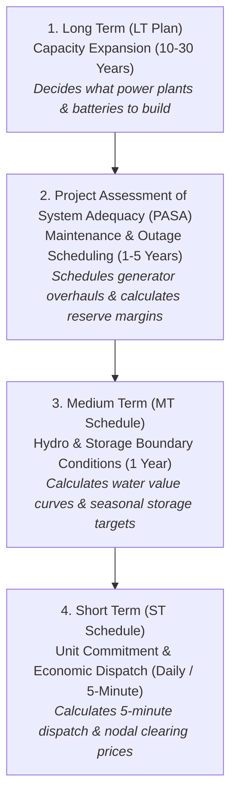

# PLEXOS Under the Hood: A Structural Comparison with NEM Dispatch Simulator

This guide provides an executive overview of **PLEXOS Integrated Energy Model** (by Energy Exemplar), how commercial electricity market modeling suites work, how the **NEM Dispatch Simulator** implements its core algorithms, and how to discuss these concepts authoritatively with hiring panels and executive directors.

---

## 1. What is PLEXOS Actually?

PLEXOS is the dominant commercial simulation software used across the Australian National Electricity Market (AEMO, DCCEEW, Transgrid, AER, and gentailers).

At its core, **PLEXOS is not a physical black-box machine; it is a relational database and Graphical User Interface (GUI) wrapped around industrial mathematical optimization solvers** (such as CPLEX, Gurobi, or Xpress).

PLEXOS organizes power system simulation into four hierarchical timeframes:

| PLEXOS Module | Horizon | Mathematical Formulation | What It Solves |
| :--- | :--- | :--- | :--- |
| **LT Plan** (Long Term) | 10–30 Years | Mixed-Integer Linear Programming (MILP) / LP | Optimal generation build, storage expansion, and transmission lines under policy mandates (e.g. Net Zero targets). |
| **PASA** | 1–5 Years | Heuristic / Integer Programming | Scheduled generator maintenance windows, Loss of Load Probability (LOLP), Expected Unserved Energy (EUE). |
| **MT Schedule** | 1 Year | Stochastic Dynamic Programming / LP | Seasonal hydro storage management, water opportunity values, and multi-month gas contract caps. |
| **ST Schedule** | Days / Weeks | MILP / LP (Interval Dispatch) | **5-minute economic dispatch, unit commitment, BESS cycling, transmission constraints, and spot prices.** |

---

## 2. How the NEM Dispatch Simulator Maps to PLEXOS ST Schedule

The **NEM Dispatch Simulator** directly reproduces the mathematical engine of the **PLEXOS ST Schedule (Short Term Economic Dispatch)**:

| Modeling Feature | PLEXOS Implementation | NEM Dispatch Simulator Implementation |
| :--- | :--- | :--- |
| **Objective Function** | Minimizes total generation costs, start-up costs, unserved energy penalties, and wheeling charges. | Formulates linear objective minimizing $\sum C_i \cdot p_i + C_{\text{deg}} \cdot d + \text{MPC} \cdot s_{\text{def}}$. |
| **Solver Engine** | Solves via external commercial engines (CPLEX / Gurobi / Xpress). | Solves via **HiGHS (Dual Revised Simplex / Interior Point)** via `scipy.optimize.linprog`. |
| **Dispatch Resolution** | 5-minute dispatch intervals or 30-minute trading intervals. | Configurable $\Delta t$ (30-minute or 5-minute intervals). |
| **Storage Modeling** | Models state of charge, round-trip efficiency, charge/discharge power, and head loss. | Mass-energy conservation constraint with round-trip efficiency $\eta$ and cycle degradation penalty. |
| **Price Formation** | Dual variable (Lagrangian shadow price) of the regional energy balance constraint. | Dual variable ($\lambda_t$) extracted directly from HiGHS equality constraints (`res.eqlin.marginals`). |
| **Transmission** | Linear DC power flow with flow limits and marginal loss factors (MLFs). | Interconnector import limits and marginal wheeling tariffs. |
| **Emissions** | Calculates total emissions via fuel heat rates and emissions intensity factors. | Direct interval-by-interval emissions calculation based on generator fuel factors. |

---

## 3. Key PLEXOS Jargon & Concepts for Interviews

When speaking to **Ben Cirulis** or the DCCEEW Energy Data & Analytics team, using the correct terminology demonstrates natural domain fluency:

### 1. "Marginal Clearing Price" vs "Bid Stacks"
* **Concept**: In the NEM, generators submit bids across 10 price bands (-$1,000 to +$17,500/MWh). In economic dispatch models like PLEXOS, generators are dispatched in **merit order** based on their Short-Run Marginal Cost (SRMC). 
* **Key Phrase**: *"The clearing price is the shadow price of the supply-demand balance constraint, set by the marginal dispatched generator."*

### 2. "Heat Rates" and "SRMC"
* **Concept**: Thermal efficiency of coal and gas plants is measured in Heat Rate ($\text{GJ/MWh}$). Multiplying fuel cost ($\$/\text{GJ}$) by heat rate and adding Variable O&M gives the Short-Run Marginal Cost (SRMC).
* **Key Phrase**: *"I ensure that generator heat rates and fuel price assumptions are calibrated to reflect actual AEMO GenCost projections."*

### 3. "Dunkelflaute" (Dark Doldrums)
* **Concept**: Extended periods of low wind and overcast skies across southeast Australia.
* **Key Phrase**: *"While short-duration BESS flattens the daily duck curve, multi-day dunkelflaute events require Long-Duration Storage (LDS) or gas peaker firming to protect the Energy Security Target."*

### 4. "Dual Variables / Shadow Prices"
* **Concept**: The mathematical derivative of total system cost with respect to a constraint limit.
* **Key Phrase**: *"In our simulation engine, spot prices are extracted as the dual variable of the nodal energy balance, exactly as PLEXOS and NEMDE do."*

---

## 4. The Winning Narrative for Mahmudur

If asked about PLEXOS during an interview, use this framing:

> *"While many analysts know PLEXOS only as a desktop GUI where they click 'Run', my background in computational modeling and mathematical optimization (PhD QUT) means I understand the exact linear and mixed-integer programming algorithms that execute underneath that GUI.*
> 
> *To demonstrate this, I built an open-source NEM Dispatch Simulator in Python that formulates multi-interval economic dispatch, BESS state-of-charge conservation, and transmission limits, solving it via the HiGHS linear solver to extract regional shadow prices.*
> 
> *With your team of 8 analysts actively operating PLEXOS day-to-day, my value as Principal is bringing that first-principles mathematical governance: auditing input assumptions, stress-testing scenario boundary conditions, and ensuring that our market projections are defensible, transparent, and aligned with the NSW Roadmap."*
